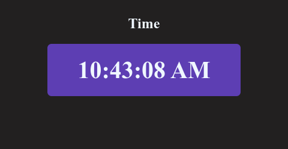

<h1>Digital Clock Project</h1>

  
This repository contains a digital clock built using HTML, CSS, and JavaScript.

  <h2>Project Overview</h2>

  
The JavaScript code retrieves the current time and updates the clock displayed on the webpage in real-time.

  <h2>Screenshots</h2>  

  <h2>Usage</h2>

  
1. Clone the repository to your local machine:

  <pre><code>git clone &lt;https://github.com/Dark-Programer/real-time-clock-web.git&gt;</code></pre>

  
2. Open the <code>index.html</code> file in your web browser to view the digital clock.

